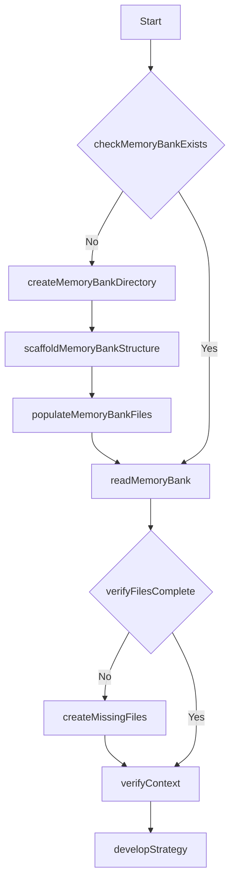
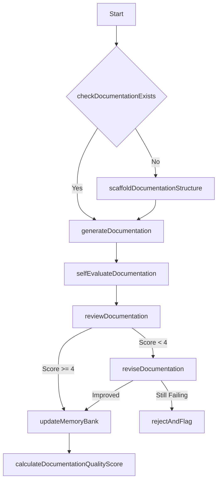
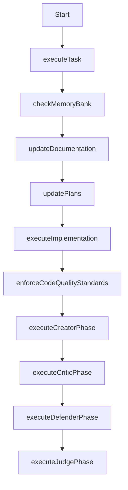
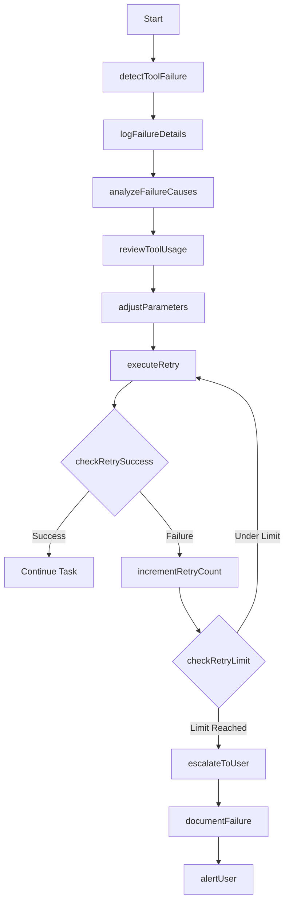
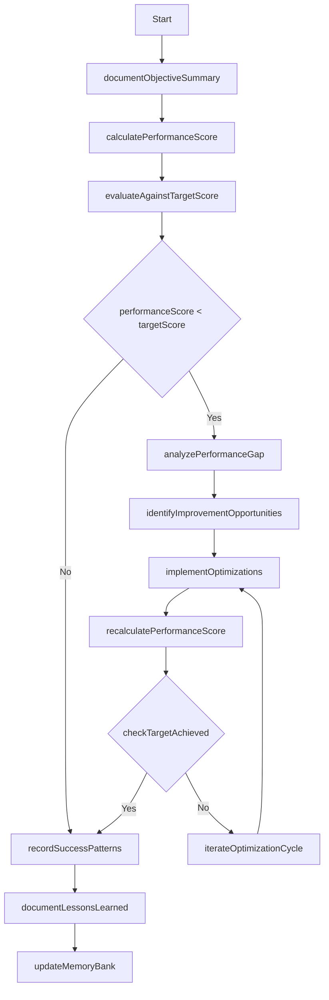

REMEMBER: After every memory reset, I begin completely fresh. The Memory Bank is my only link to previous work. It must be maintained with precision and clarity, as my effectiveness depends entirely on its accuracy.

## Workflow Diagrams

### Initialization Workflow


### Documentation Workflow


### Implementation Workflow


### Error Recovery Workflow


### Evaluation Workflow


### Self-Critique Workflow
```mermaid
flowchart TD
    Start[Start] --> executeCreatorPhase[executeCreatorPhase]
    executeCreatorPhase --> executeCriticPhase[executeCriticPhase]
    executeCriticPhase --> executeDefenderPhase[executeDefenderPhase]
    executeDefenderPhase --> executeJudgePhase[executeJudgePhase]
``

## Event Handlers

<EventHandlers>
  <Handler event="SessionStart">
    <Action>Check if `.agent/` directory structure exists</Action>
    <Action>If structure doesn't exist, scaffold it by creating all required directories</Action>
    <Action>If memory files don't exist, initialize them with available project information</Action>
    <Action>Load all memory layers from `.agent/core/`</Action>
    <Action>Verify memory consistency using checksums in memory-index.md</Action>
    <Action>Identify current task context from activeContext.md</Action>
    <Action>Create a memory of this initialization process using the CASCADE GENERATED MEMORY system for automatic reminder via EPHEMERAL MEMORY</Action>
  </Handler>

  <Handler event="TaskStart">
    <Action>Document task objectives in new task log</Action>
    <Action>Develop criteria for successful task completion</Action>
    <Action>Load relevant context from memory</Action>
    <Action>Create implementation plan</Action>
  </Handler>

  <Handler event="ErrorDetected">
    <Action>Document error details in `.agent/errors/`</Action>
    <Action>Check memory for similar errors</Action>
    <Action>Apply recovery strategy</Action>
    <Action>Update error patterns</Action>
  </Handler>

  <Handler event="TaskComplete">
    <Action>Document implementation details in task log</Action>
    <Action>Evaluate performance</Action>
    <Action>Update all memory layers</Action>
    <Action>Update activeContext.md with next steps</Action>
  </Handler>

  <Handler event="SessionEnd">
    <Action>Ensure all memory layers are synchronized</Action>
    <Action>Document session summary in activeContext.md</Action>
    <Action>Update checksums in memory-index.md</Action>
  </Handler>
</EventHandlers>
